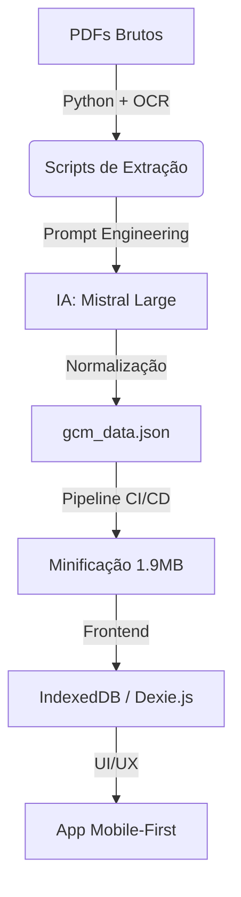

# 🛡️ GCM Simulator: High-Performance Data Engine


O **GCM Simulator** não é apenas um app de questões; é uma plataforma de estudo **mobile-first** construída sobre uma pipeline de dados automatizada. O projeto processa provas reais de Guardas Civis Municipais, normaliza conteúdos complexos via IA e entrega uma experiência de simulado instantânea e offline.


---
## 🌪️ Do Caos à Estrutura: O Desafio dos Dados
O maior desafio deste projeto não foi o código do app, mas a **natureza dos dados**. As provas de GCM são disponibilizadas em PDFs com formatações inconsistentes, OCRs de baixa qualidade e estruturas de colunas que variam drasticamente entre bancas como VUNESP, FGV e Avança SP.

Muitas vezes, os textos de apoio (contextos) estão em páginas diferentes das questões, e as alternativas se misturam ao corpo do texto. O **GCM Simulator** resolve isso através de uma "Esteira de Inteligência":

* **Extração Bruta**: Scripts Python que forçam a extração de texto mesmo em arquivos protegidos ou mal escaneados.

* **Refino com IA**: Uso do Mistral Large para atuar como um "editor humano", identificando onde termina um enunciado e onde começa uma alternativa, além de vincular logicamente cada questão ao seu respectivo texto de apoio.

* **Resultado**: O que era um emaranhado de strings desconexas virou um banco de dados relacional, limpo e pronto para o estudo.

---

## 🚀 O Diferencial Tecnológico

Diferente de simuladores comuns que dependem de APIs lentas, este projeto utiliza uma arquitetura de **Dados Locais de Alta Performance**:

1.  **Data Mining & OCR:** Scripts em Python extraem textos de PDFs de bancas variadas (VUNESP, FGV, Avança SP, etc).
2.  **AI Normalization (Mistral Large):** Processamento inteligente para corrigir erros de leitura, categorizar matérias e vincular textos de apoio (contextos) às questões de forma relacional.
3.  **JSON Minification:** Um banco de dados mestre de 54 provas compactado em apenas **1.9MB**, otimizado para dispositivos móveis.
4.  **IndexedDB Engine:** Utilização do **Dexie.js** para persistência no navegador, garantindo filtros instantâneos por matéria, banca ou ano, sem necessidade de conexão constante com a internet.

---

## 🛠️ Arquitetura do Sistema



---

## 📂 Estrutura do Repositório

`/frontend`: Aplicação React/Vite com arquitetura de componentes escalável e design Dark Mode.

`/data-engine`: O "coração" do projeto. Contém os scripts Python de tratamento, limpeza e normalização de dados.

`gcm_data.json`: A Single Source of Truth do projeto contendo toda a base de questões estruturada.

---


## ⚙️ Como rodar o projeto

### Pré-requisitos

* Node.js (v18+)

* Python 3.10+


### Instalação


1. Clone o repositório:

```bash
git clone https://github.com/vitor-carmo/gcm-simulator.git
```

2. Instale as dependências do Frontend:

```bash
cd frontend && yarn
```
3. Inicie o ambiente de desenvolvimento:

```bash
yarn dev
```


<div align="center">

**⭐ Deixe uma estrela neste repositório se ele for útil para você!**


Feito com ❤️ por [Vitor Carmo](https://github.com/Vitor-Carmo)

</div>