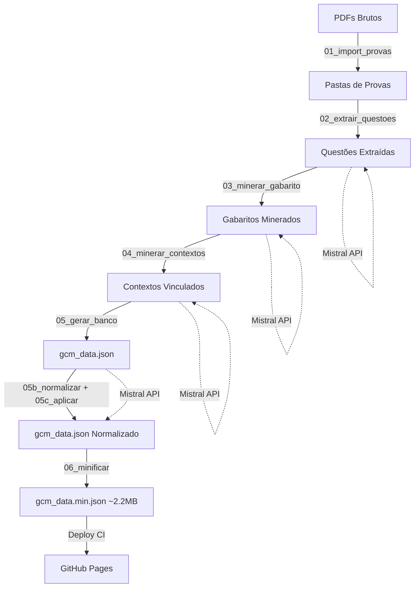

# 🛡️ GCM Simulator: High-Performance Data Engine


O **GCM Simulator** não é apenas um app de questões; é uma plataforma de estudo **mobile-first** construída sobre uma pipeline de dados automatizada. O projeto processa provas reais de Guardas Civis Municipais, normaliza conteúdos complexos via IA e entrega uma experiência de simulado instantânea e offline.


---
## 🌪️ Do Caos à Estrutura: O Desafio dos Dados
O maior desafio deste projeto não foi o código do app, mas a **natureza dos dados**. As provas de GCM são disponibilizadas em PDFs com formatações inconsistentes, OCRs de baixa qualidade e estruturas de colunas que variam drasticamente entre bancas como VUNESP, FGV e Avança SP.

Muitas vezes, os textos de apoio (contextos) estão em páginas diferentes das questões, e as alternativas se misturam ao corpo do texto. O **GCM Simulator** resolve isso através de uma "Esteira de Inteligência":

* **Extração Bruta**: Scripts Python que forçam a extração de texto mesmo em arquivos protegidos ou mal escaneados.

* **Refino com IA**: Uso do Mistral para atuar como um "editor humano", identificando onde termina um enunciado e onde começa uma alternativa, além de vincular logicamente cada questão ao seu respectivo texto de apoio.

* **Resultado**: O que era um emaranhado de strings desconexas virou um banco de dados relacional, limpo e pronto para o estudo.

---

## 🚀 O Diferencial Tecnológico

Diferente de simuladores comuns que dependem de APIs lentas, este projeto utiliza uma arquitetura de **Dados Locais de Alta Performance**:

1.  **Data Mining & OCR:** Scripts em Python extraem textos de PDFs de bancas variadas (VUNESP, FGV, Avança SP, etc).
2.  **AI Normalization (Mistral):** Processamento inteligente para corrigir erros de leitura, categorizar matérias e vincular textos de apoio (contextos) às questões de forma relacional.
3.  **JSON Minification:** Um banco de dados mestre de 54 provas compactado em **~2.2MB**, otimizado para dispositivos móveis.
4.  **IndexedDB Engine:** Utilização do **Dexie.js** para persistência no navegador, garantindo filtros instantâneos por matéria, banca ou ano, sem necessidade de conexão constante com a internet.

---

## 🛠️ Arquitetura do Sistema



---

## 📂 Estrutura do Repositório

`/frontend`: Aplicação React/Vite com arquitetura de componentes escalável e design Dark Mode.

`/data-engine`: O "coração" do projeto. Contém os scripts Python de tratamento, limpeza e normalização de dados.

`/data-engine/scripts`: Scripts da pipeline de processamento (01 a 07).

`gcm_data.json`: A Single Source of Truth do projeto contendo toda a base de questões estruturada.

---

## 🧪 Testes

51 testes cobrindo os componentes principais do frontend (Vitest + Testing Library):

- `reservoirSample.test.js` — algoritmo de sampling aleatório
- `SimuladoPage.test.jsx` — navegação e setas
- `QuestionCard.test.jsx` — alternativas, confirmação e feedback
- `MenuPage.test.jsx` — modos de simulado e início
- `ResultadoPage.test.jsx` — score, matérias e gabarito

```bash
cd frontend && yarn test        # modo interativo
cd frontend && yarn test:run    # uma vez (usado no CI)
```

---

## ⚙️ Como rodar o projeto

### Pré-requisitos

- Node.js (v18+)
- Python 3.10+
- Yarn
- API Key do Mistral ([obtenha em console.mistral.ai](https://console.mistral.ai))

### Instalação

1. Clone o repositório:

```bash
git clone https://github.com/vitor-carmo/gcm-simulator.git
```

2. Instale as dependências do Frontend:

```bash
cd frontend && yarn
```

3. Configure o Data Engine:

```bash
cd data-engine
python -m venv venv
source venv/bin/activate
pip install -r requirements.txt
```

4. Configure a variável de ambiente:

```bash
cp .env.example .env
# Edite .env e adicione sua MISTRAL_API_KEY
```

### Rodar o app

```bash
cd frontend && yarn dev
```

### Pipeline de Dados

```bash
cd data-engine/scripts

# Rodar toda a pipeline
python run_pipeline.py

# Rodar passos específicos
python run_pipeline.py 1 5    # passos 1 a 5
python run_pipeline.py 6 7    # só minificação e CDN
```

| Passo | Script | Descrição |
|-------|--------|-----------|
| 01 | `01_import_provas.py` | Importa pastas de provas do diretório raw-provas |
| 02 | `02_extrair_questoes.py` | Extrai questões de PDFs usando Mistral |
| 03 | `03_minerar_gabarito.py` | Minera gabaritos usando Mistral |
| 04 | `04_minerar_contextos.py` | Vincula textos de apoio (contextos) usando Mistral |
| 05 | `05_gerar_banco.py` | Gera gcm_data.json consolidado |
| 05b | `05b_normalizar.py` | Normaliza dados via Mistral |
| 05c | `05c_aplicar_normalizacao.py` | Aplica normalizações ao banco |
| 06 | `06_minificar.py` | Minifica para gcm_data.min.json |
| 07 | `07_sync_cdn.py` | Sincroniza PDFs com CDN |

---

## 🚀 Deploy

A cada push na branch `main`, o GitHub Actions:

1. **Roda os testes** (`yarn test:run`) — se falhar, para aqui
2. **Minifica os dados** (`06_minificar.py`)
3. **Builda o frontend** (`yarn build`)
4. **Deploy para GitHub Pages**

---

<div align="center">

**⭐ Deixe uma estrela neste repositório se ele for útil para você!**

Feito com ❤️ por [Vitor Carmo](https://github.com/Vitor-Carmo)

</div>
